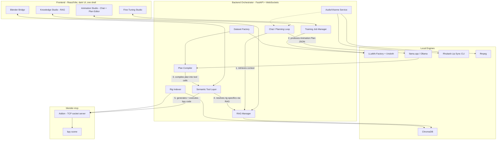

# Architecture

## 1. The Core Design Decision: Plan, Then Compile, Then Execute

The other conversation you pasted made one really good point buried in the enterprise-y framing:
**don't fine-tune the model to output raw Blender code or low-level MCP calls.** Have it output a
structured, rig-agnostic *Animation Plan* instead — emotion, gestures, locomotion, camera, lip-sync
— and let a completely separate, deterministic layer turn that plan into whatever a specific rig
actually needs. This is a genuine improvement over my first draft, and it's *also* what makes "all
sorts of animations" tractable instead of needing a differently-trained model per animation type.

Three layers, three very different jobs:

| Layer | Lives in | Job | Example |
|---|---|---|---|
| **Fine-tuned model** | Model weights | Animation *reasoning* — the transferable skill of turning an ask ("nervous before a speech") into a coherent, well-timed plan. This is exactly what small-model fine-tuning is good at: a stable, repeatable skill, not a pile of facts. | "nervous → small gestures, tense shoulders, increased blink rate, occasional eye darts" |
| **RAG** | Vector store, retrieved per request | Everything *specific* to one character or studio: controller names, rig limits, personality sheet, house style, past successful plans. Trivially updatable — add a document, no retraining. | "Aiko: CTRL_Head, CTRL_Eyes, Smile_L/R, Jaw_Open, neck rotation capped at 35°, uses ARKit visemes" |
| **Semantic Tool Layer + Plan Compiler** | Plain Python, **not an LLM at all** | Deterministically turns a Plan into actual Blender keyframes/F-curves for *this* rig. Must never hallucinate — it's ordinary, testable code you write once and reuse for every character. | `wave(character="Aiko", start=2.3, end=3.1, intensity=0.6)` → real bone rotations on `CTRL_ArmR` |

This reframes your original question cleanly: fine-tuning owns everything that transfers across
every character you'll ever load; RAG owns everything that's true of exactly one character; the
tool layer owns everything that must be reliable no matter what the model says. None of the three
layers is asked to do a job it's bad at.

> **On the base-model choice, this changes something important:** because the LLM's job is now
> "produce a structured JSON plan" rather than "write correct executable Python," a general
> **Instruct** model is actually a better fit than a **Coder** model — see §4. Code generation gets
> pushed down into the deterministic tool layer, where it belongs.

---

## 2. Hardware Reality Check

| Task | Model / size | Approx. VRAM | Fits on 6GB? |
|---|---|---|---|
| QLoRA fine-tuning (r=16, seq 2048, bs=1+accum, grad checkpointing) | Qwen2.5-3B-Instruct (or Qwen3-4B-Instruct) | ~4–5 GB | **Yes — primary target** |
| QLoRA fine-tuning, aggressive settings (r=8, seq 1024, paged 8-bit optimizer) | Qwen2.5-7B-Instruct / Qwen3-8B-Instruct | ~6–8 GB | **Stretch goal** — commonly-cited comfortable minimum is 8GB; JSON-plan output is a lighter target than code gen, so this is more forgiving than my original code-gen plan, but still budget for OOM fights |
| Inference only (serving a trained/merged model) | 7B–8B, Q4_K_M GGUF | ~5–6 GB incl. KV cache | **Yes** — inference is much cheaper than training |
| Embedding generation for RAG | nomic-embed-text-v2 or bge-small (<500M params) | negligible, CPU only | Yes — keep off the GPU entirely |
| Rhubarb Lip Sync (viseme extraction) | CLI tool, CPU only | 0 GB | Yes |
| Blender headless validation runs | N/A | 0–2 GB | Yes, run without GPU viewport where possible |
| Rare escape-hatch code-gen (see §5) | Cloud model, or un-finetuned Qwen2.5-Coder locally | n/a / ~4–5 GB | Only invoked for the small % of requests the tool layer can't cover |

**Practical consequence:** build and validate on the 3B model first. The 7B is an experiment you
run once the architecture is proven — don't block progress on squeezing it onto the card.

---

## 3. System Architecture

**What changed from a "raw tool-call" architecture, and why it matters for "all sorts of
animations":** the model never sees bone names and never writes Blender code. It only ever
produces one thing — an Animation Plan (§6) — regardless of whether the request is a speech, a
wave, a walk cycle, or a camera move. The Plan Compiler + Semantic Tool Layer (§5) is what actually
knows how to talk to Blender, and it's a small, growable library of plain Python functions, not a
second MCP server. New animation types mostly mean adding one more tool function, not retraining.

**Component notes**

- **blender-mcp** (ahujasid, MIT, open source) is still the only thing that actually talks to
  Blender. The Semantic Tool Layer calls its `execute_blender_code` primitive under the hood — it's
  an internal abstraction in *your* backend, not a second protocol server.
- **The LLM never runs Rhubarb, ffmpeg, or the rig indexer.** Those stay fully deterministic and
  off to the side; the model only ever reasons over their *output*.
- **RAG store is CPU-only**, so the 3050's VRAM stays 100% available for the LLM.

---

## 4. Model & Tooling Choices

| Layer | Pick | Why |
|---|---|---|
| Base model | **Qwen2.5-3B-Instruct** (primary), Qwen2.5-7B-Instruct / Qwen3-8B-Instruct (stretch) | **Changed from Coder to general Instruct.** The model's job is now structured planning + emotional/creative reasoning, not code generation — the Coder variant's strength (Python syntax) is no longer what's being tested. General instruct models are broader at instruction-following and "reasoning about a request," which is what an animation-planning task actually needs. |
| Escape-hatch code-gen | Un-finetuned **Qwen2.5-Coder-3B/7B** (local) or a cloud model, invoked rarely | For the small percentage of requests the Semantic Tool Layer genuinely can't cover (a truly novel one-off action). Doesn't need to be fine-tuned since it's rare and low-stakes to run slower/via cloud. |
| Fine-tuning engine | **Unsloth** driven through **LLaMA-Factory** | LLaMA-Factory ships **LLaMA Board**, a Gradio no-code UI (browse model, browse dataset, hyperparameter form, live loss chart, checkpoint chat-test) — 90% of the fine-tuning UI you described, out of the box. Use it directly for the MVP, then have your FastAPI backend drive the same engine headlessly once you want your own branded UI. |
| Method | QLoRA, 4-bit, rank 16 (drop to 8 if tight), gradient checkpointing | JSON-plan output is an easier fine-tuning target than executable code — expect this to need fewer examples and be more forgiving than a code-gen objective would have been. |
| Serving | **llama.cpp / Ollama**, GGUF Q4_K_M | Cheap relative to training; room to run the 7B/8B even if you only trained the 3B. |
| RAG vector store | **ChromaDB** (embedded, no server process) | Simple, Python-native, persists to disk. |
| Embedding model | **nomic-embed-text-v2** (or bge-small fallback) | Small footprint, CPU-friendly, plenty accurate for a corpus of thousands of chunks (docs + rig manifests + past plans), not millions. |
| Blender bridge | **blender-mcp** (ahujasid/blender-mcp) | Existing, MIT-licensed, works with any MCP client. |
| Lip sync | **Rhubarb Lip Sync** (CLI) | Mature, offline, deterministic 9-viseme timeline from a WAV, no GPU. Multilingual alternatives (a native Blender "Lip Sync" extension using Vosk + eSpeak NG, or LipKit) exist if you need non-English. |
| Audio mux | **ffmpeg** | Standard, deterministic. |
