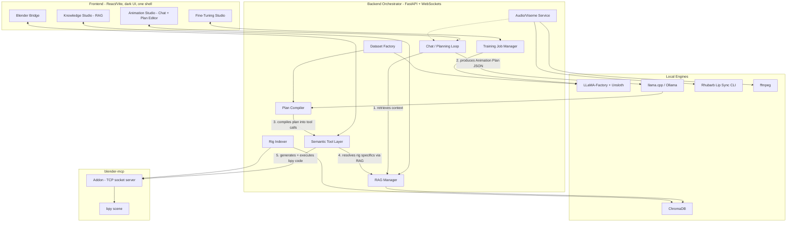

# Local LLM + RAG + Blender MCP Animation Pipeline — Project Plan

> Goal: a fully local system where you drop in a rigged character (+ rig guide) and describe *any*
> animation — talking, gesturing, walking, reacting, camera work — and a fine-tuned local model
> (backed by RAG, driving Blender through MCP) produces it, with **zero code touched by you at
> runtime**. Everything (fine-tuning, RAG, Blender bridge, chat) lives behind one UI.

**Target hardware:** RTX 3050 6GB VRAM · 16GB RAM · i5 12th-gen. Every recommendation below is
chosen to actually run on this box. You're already running ComfyUI/LTX Video and a custom
LoRA-selector node on this same card for the companion-app project, so the VRAM discipline here
isn't new territory — same budget, different workload.

**v2 changelog:** merged in the "animation director" architecture from the second conversation you
pasted — structured intent plans, a semantic tool layer, dataset split by what's transferable vs.
character-specific — and broadened scope from "speaking animation" to animation in general. I kept
the good ideas from that conversation but re-sized a few of them (model choice, multi-stage
planning, graph RAG) to actually fit a single 6GB card run by one person, rather than an
enterprise-scale build. Details on what changed and why are inline.

---

## Table of Contents
1. [The Core Design Decision: Plan, Then Compile, Then Execute](#1-the-core-design-decision-plan-then-compile-then-execute)
2. [Hardware Reality Check](#2-hardware-reality-check)
3. [System Architecture](#3-system-architecture)
4. [Model & Tooling Choices](#4-model--tooling-choices)
5. [The Semantic Tool Layer](#5-the-semantic-tool-layer)
6. [The Animation Intent Plan](#6-the-animation-intent-plan)
7. [The Fine-Tuning Dataset](#7-the-fine-tuning-dataset)
8. [Understanding "Production Quality" Rigs](#8-understanding-production-quality-rigs)
9. [Pipeline Walkthrough — Two Examples](#9-pipeline-walkthrough--two-examples)
10. [The UI — Four Studios, One Shell](#10-the-ui--four-studios-one-shell)
11. [Phased Roadmap](#11-phased-roadmap)
12. [Risks & Mitigations](#12-risks--mitigations)
13. [Assumptions I Made](#13-assumptions-i-made)
14. [Reference Links](#14-reference-links)

---

## 1. The Core Design Decision: Plan, Then Compile, Then Execute

The other conversation you pasted made one really good point buried in the enterprise-y framing:
**don't fine-tune the model to output raw Blender code or low-level MCP calls.** Have it output a
structured, rig-agnostic *Animation Plan* instead — emotion, gestures, locomotion, camera, lip-sync
— and let a completely separate, deterministic layer turn that plan into whatever a specific rig
actually needs. This is a genuine improvement over my first draft, and it's *also* what makes "all
sorts of animations" tractable instead of needing a differently-trained model per animation type.

Three layers, three very different jobs:

| Layer | Lives in | Job | Example |
|---|---|---|---|
| **Fine-tuned model** | Model weights | Animation *reasoning* — the transferable skill of turning an ask ("nervous before a speech") into a coherent, well-timed plan. This is exactly what small-model fine-tuning is good at: a stable, repeatable skill, not a pile of facts. | "nervous → small gestures, tense shoulders, increased blink rate, occasional eye darts" |
| **RAG** | Vector store, retrieved per request | Everything *specific* to one character or studio: controller names, rig limits, personality sheet, house style, past successful plans. Trivially updatable — add a document, no retraining. | "Aiko: CTRL_Head, CTRL_Eyes, Smile_L/R, Jaw_Open, neck rotation capped at 35°, uses ARKit visemes" |
| **Semantic Tool Layer + Plan Compiler** | Plain Python, **not an LLM at all** | Deterministically turns a Plan into actual Blender keyframes/F-curves for *this* rig. Must never hallucinate — it's ordinary, testable code you write once and reuse for every character. | `wave(character="Aiko", start=2.3, end=3.1, intensity=0.6)` → real bone rotations on `CTRL_ArmR` |

This reframes your original question cleanly: fine-tuning owns everything that transfers across
every character you'll ever load; RAG owns everything that's true of exactly one character; the
tool layer owns everything that must be reliable no matter what the model says. None of the three
layers is asked to do a job it's bad at.

> **On the base-model choice, this changes something important:** because the LLM's job is now
> "produce a structured JSON plan" rather than "write correct executable Python," a general
> **Instruct** model is actually a better fit than a **Coder** model — see §4. Code generation gets
> pushed down into the deterministic tool layer, where it belongs.

---

## 2. Hardware Reality Check

| Task | Model / size | Approx. VRAM | Fits on 6GB? |
|---|---|---|---|
| QLoRA fine-tuning (r=16, seq 2048, bs=1+accum, grad checkpointing) | Qwen2.5-3B-Instruct (or Qwen3-4B-Instruct) | ~4–5 GB | **Yes — primary target** |
| QLoRA fine-tuning, aggressive settings (r=8, seq 1024, paged 8-bit optimizer) | Qwen2.5-7B-Instruct / Qwen3-8B-Instruct | ~6–8 GB | **Stretch goal** — commonly-cited comfortable minimum is 8GB; JSON-plan output is a lighter target than code gen, so this is more forgiving than my original code-gen plan, but still budget for OOM fights |
| Inference only (serving a trained/merged model) | 7B–8B, Q4_K_M GGUF | ~5–6 GB incl. KV cache | **Yes** — inference is much cheaper than training |
| Embedding generation for RAG | nomic-embed-text-v2 or bge-small (<500M params) | negligible, CPU only | Yes — keep off the GPU entirely |
| Rhubarb Lip Sync (viseme extraction) | CLI tool, CPU only | 0 GB | Yes |
| Blender headless validation runs | N/A | 0–2 GB | Yes, run without GPU viewport where possible |
| Rare escape-hatch code-gen (see §5) | Cloud model, or un-finetuned Qwen2.5-Coder locally | n/a / ~4–5 GB | Only invoked for the small % of requests the tool layer can't cover |

**Practical consequence:** build and validate on the 3B model first. The 7B is an experiment you
run once the architecture is proven — don't block progress on squeezing it onto the card.

---

## 3. System Architecture



**What changed from a "raw tool-call" architecture, and why it matters for "all sorts of
animations":** the model never sees bone names and never writes Blender code. It only ever
produces one thing — an Animation Plan (§6) — regardless of whether the request is a speech, a
wave, a walk cycle, or a camera move. The Plan Compiler + Semantic Tool Layer (§5) is what actually
knows how to talk to Blender, and it's a small, growable library of plain Python functions, not a
second MCP server. New animation types mostly mean adding one more tool function, not retraining.

**Component notes**

- **blender-mcp** (ahujasid, MIT, open source) is still the only thing that actually talks to
  Blender. The Semantic Tool Layer calls its `execute_blender_code` primitive under the hood — it's
  an internal abstraction in *your* backend, not a second protocol server.
- **The LLM never runs Rhubarb, ffmpeg, or the rig indexer.** Those stay fully deterministic and
  off to the side; the model only ever reasons over their *output*.
- **RAG store is CPU-only**, so the 3050's VRAM stays 100% available for the LLM.

---

## 4. Model & Tooling Choices

| Layer | Pick | Why |
|---|---|---|
| Base model | **Qwen2.5-3B-Instruct** (primary), Qwen2.5-7B-Instruct / Qwen3-8B-Instruct (stretch) | **Changed from Coder to general Instruct.** The model's job is now structured planning + emotional/creative reasoning, not code generation — the Coder variant's strength (Python syntax) is no longer what's being tested. General instruct models are broader at instruction-following and "reasoning about a request," which is what an animation-planning task actually needs. |
| Escape-hatch code-gen | Un-finetuned **Qwen2.5-Coder-3B/7B** (local) or a cloud model, invoked rarely | For the small percentage of requests the Semantic Tool Layer genuinely can't cover (a truly novel one-off action). Doesn't need to be fine-tuned since it's rare and low-stakes to run slower/via cloud. |
| Fine-tuning engine | **Unsloth** driven through **LLaMA-Factory** | LLaMA-Factory ships **LLaMA Board**, a Gradio no-code UI (browse model, browse dataset, hyperparameter form, live loss chart, checkpoint chat-test) — 90% of the fine-tuning UI you described, out of the box. Use it directly for the MVP, then have your FastAPI backend drive the same engine headlessly once you want your own branded UI. |
| Method | QLoRA, 4-bit, rank 16 (drop to 8 if tight), gradient checkpointing | JSON-plan output is an easier fine-tuning target than executable code — expect this to need fewer examples and be more forgiving than a code-gen objective would have been. |
| Serving | **llama.cpp / Ollama**, GGUF Q4_K_M | Cheap relative to training; room to run the 7B/8B even if you only trained the 3B. |
| RAG vector store | **ChromaDB** (embedded, no server process) | Simple, Python-native, persists to disk. |
| Embedding model | **nomic-embed-text-v2** (or bge-small fallback) | Small footprint, CPU-friendly, plenty accurate for a corpus of thousands of chunks (docs + rig manifests + past plans), not millions. |
| Blender bridge | **blender-mcp** (ahujasid/blender-mcp) | Existing, MIT-licensed, works with any MCP client. |
| Lip sync | **Rhubarb Lip Sync** (CLI) | Mature, offline, deterministic 9-viseme timeline from a WAV, no GPU. Multilingual alternatives (a native Blender "Lip Sync" extension using Vosk + eSpeak NG, or LipKit) exist if you need non-English. |
| Audio mux | **ffmpeg** | Standard, deterministic. |

---

## 5. The Semantic Tool Layer

This is the new piece, and it's what lets one small model cover "all sorts of animations" without
retraining per animation type. It's a library of plain Python functions in your backend — **not**
a second MCP server, just internal abstractions that generate the right `bpy` code for whichever
rig is currently loaded (by looking up its manifest, see §8) and execute it via blender-mcp's
`execute_blender_code`.

Starting tool set (grow this over time; adding a tool doesn't require retraining the model if the
Plan schema already has a slot for it — see §6):

| Tool | Covers |
|---|---|
| `lip_sync(character, audio_file, transcript?)` | Speech — pulls the Rhubarb viseme timeline and maps it to this rig's mouth shape keys/bones |
| `set_emotion(character, emotion, intensity)` | Facial expression blend (brows, mouth corners, eye shape) |
| `gesture(character, type, start, end, intensity)` | Wave, raise-hand, point, shrug, and other short arm/hand actions |
| `look_at(character, target, start, end)` | Eye/head aim at camera, another character, or a point |
| `blink(character, rate)` | Natural / increased / rare blink cycles |
| `head_motion(character, style, intensity)` | Nodding, small tension movements, idle sway |
| `create_walk(character, path, speed, style)` | Locomotion — walk/run cycles along a path |
| `idle(character, style)` | Subtle breathing/weight-shift loop for moments with no explicit action |
| `camera_pan(...)` / `camera_follow(...)` / `camera_shot(type)` | Camera framing and movement |
| `export_video(output_path, mux_audio=True)` | Final render + ffmpeg mux |

Each tool internally resolves *this specific rig's* controller names from the rig manifest/RAG
before generating code — the model calling `gesture("Aiko", "wave", 2.3, 3.1, 0.6)` never needs to
know that Aiko's arm controller is called `CTRL_ArmR_IK`.

---

## 6. The Animation Intent Plan

This is the model's actual fine-tuning *output target* — a structured, rig-agnostic JSON document
covering any combination of animation types in one request:

```json
{
  "character": "Aiko",
  "duration_seconds": 5.2,
  "emotion": { "primary": "nervous", "intensity": 0.6 },
  "body_language": { "posture": "tense_shoulders", "energy": "low" },
  "head_motion": { "style": "small_movements", "nod_frequency": "rare" },
  "eye_behavior": { "target": "camera", "blink_rate": "increased", "eye_darts": true },
  "lip_sync": { "enabled": true, "audio_file": "line_04.wav", "transcript": "Hello everyone..." },
  "gestures": [
    { "start": 2.3, "end": 3.1, "type": "raise_right_hand", "intensity": 0.4 },
    { "start": 4.0, "end": 4.6, "type": "adjust_collar" }
  ],
  "locomotion": null,
  "camera": { "shot": "medium_close_up", "movement": "static" },
  "notes": "Keep gestures small and hesitant to match the nervous emotional state."
}
```

The Plan Compiler (deterministic, no LLM) walks this JSON and calls the matching Semantic Tools —
`lip_sync(...)`, `gesture("raise_right_hand", 2.3, 3.1, 0.4)`, `camera_shot("medium_close_up")`,
etc. Because `locomotion` is just `null` here and becomes a populated object for a walk request,
**one schema covers every animation type you listed** — speech, gesture, full-body movement,
camera direction — instead of needing a separate model or dataset per category.

> **On the multi-stage "Intent → Emotion → Gesture → Camera → Validator" pipeline from the other
> conversation:** it's a reasonable idea for a production studio with GPU headroom to spare, but
> running five or six sequential LLM calls per request adds real latency on a single 6GB card
> serving one small local model. Start with **one call producing the whole Plan above in a single
> pass** — a well-built dataset (§7) can teach a 3B/7B model to reason through emotion, gesture,
> and camera together. Only split it into sequential prompts *to the same model* (different system
> prompts per stage, not different models) later, and only if evaluation shows the single-pass
> version is conflating concerns badly enough to justify the extra latency.

The Animation Studio UI should show this Plan before compiling it — see §10 — so you can nudge a
slider (emotion intensity, gesture timing) without touching a JSON file directly.

---

## 7. The Fine-Tuning Dataset

Same distillation-and-validate approach as before, but the target output is now a Plan, not code:

1. **Bootstrap** — use a strong model you already have access to (Claude, or an Antigravity-style
   session) to generate `(character context + request) → Animation Plan` pairs across a wide
   variety of requests: dialogue delivery, gestures, walk cycles, camera direction, reactive
   emotional beats. Include a short reasoning trace before the JSON, the way an animator would
   think it through — this is genuinely useful training signal, not filler:
   ```
   Reasoning: nervous before a speech -> avoid large gestures, keep shoulders tense, increase
   blink frequency, add small eye darts, keep head motion minimal.

   Plan: { ...json... }
   ```
2. **Validate mechanically** — run every candidate Plan through the *real* Plan Compiler + Semantic
   Tool Layer in headless Blender and check it executes without error and produces sane keyframes.
   This is free (CPU time only) and catches Plans that reference fields your tool layer doesn't
   support yet.
3. **Curate lightly** — spot-check survivors before they enter the training set. 500 clean,
   verified examples reliably beats 5,000 noisy ones for behavior/format adaptation.
4. **Cover the long tail on purpose** — dialogue delivery across emotions, the full gesture list,
   locomotion requests, camera-only requests, combined requests ("walk over while waving, nervous"),
   and a few **"ask instead of guess"** examples for when a request needs a capability the current
   rig genuinely doesn't have (e.g., asking a rig with no leg rig to walk) — the target output
   should be a clarifying/limitation note, not an invented capability.

---

## 8. Understanding "Production Quality" Rigs

The model never needs literal bone names anymore — that job moved to the Semantic Tool Layer. But
the *Planning* model still needs to know what a given rig **can do**, so it doesn't plan a walk
cycle for an upper-body-only rig. The Rig Indexer now produces two things instead of one:

1. **Literal manifest** (as before — bone hierarchy, shape key names, naming-convention guesses) —
   consumed only by the Semantic Tool Layer when it compiles a Plan into real keyframes.
2. **Capability summary** (new) — a short, human-readable abstraction fed into the Planning model's
   context: *"Aiko: full upper-body FK+IK, 9 facial visemes (ARKit subset), no leg rig — cannot
   walk, neck rotation capped at 35°, uses a Rigify face-rig extension."* This is what makes the
   model's reasoning rig-aware without ever exposing it to bone names directly.

```json
{
  "character_name": "Aiko_v3",
  "blend_file": "aiko_v3_rigged.blend",
  "capability_summary": "Full upper-body FK+IK, 9 facial visemes (ARKit subset), no leg/locomotion rig, neck rotation capped at 35 degrees.",
  "armature": {
    "name": "AikoRig",
    "bone_count": 214,
    "face_bones": ["jaw", "tongue_01", "tongue_02", "lip_upper_L", "lip_upper_R"],
    "naming_convention_guess": "Rigify (face rig extension)"
  },
  "shape_keys": {
    "mesh": "Aiko_Head",
    "basis": "Basis",
    "keys": ["viseme_AA", "viseme_E", "viseme_FV", "viseme_L", "viseme_M", "viseme_O", "viseme_U", "viseme_WQ", "eyeBlink_L", "eyeBlink_R"],
    "naming_convention_guess": "ARKit-52 subset"
  },
  "existing_actions": ["idle_loop", "blink_cycle"],
  "fps": 24,
  "notes_for_llm": "No neutral-pose action found; use the 'Basis' shape key as the mouth-closed reference."
}
```

Stored in the RAG store as a retrievable per-character document; the capability summary is also
injected directly into context for the current session so the Planning model always knows the
current rig's limits without a retrieval round-trip.

**Optional, later:** a lightweight **rig graph** (which controller affects which region — e.g.
"which control moves the upper lip") instead of a flat manifest, so the Semantic Tool Layer can
answer structural questions when compiling a Plan for an unfamiliar rig convention. This is worth
building once you have enough rigs that flat name-matching starts missing things — not a Phase 1–4
requirement. A plain Python dict/`networkx` graph alongside the manifest is enough; you don't need
a dedicated graph database at this scale.

---

## 9. Pipeline Walkthrough — Two Examples

**A. "Make her nervous before this speech, using this audio"**
1. Rhubarb extracts a viseme timeline from the audio (deterministic, no LLM).
2. Backend retrieves Aiko's capability summary + personality sheet from RAG.
3. Planning model produces the Animation Plan in §6 (emotion, blinks, gestures, lip_sync, camera).
4. You review/tweak the Plan in the UI (§10).
5. Plan Compiler calls `set_emotion`, `blink`, `gesture`, `lip_sync`, `camera_shot` in sequence.
6. Each tool resolves Aiko's actual controllers and executes via blender-mcp.
7. `export_video` renders and muxes the audio in with ffmpeg.

**B. "Have her walk across the room and wave at the camera"**
1. No audio involved — `lip_sync` stays disabled in the Plan.
2. Capability summary check: does this rig have a locomotion rig? (If not, this is exactly the
   "ask instead of guess" case from §7 — the model should say so, not fake it.)
3. Plan includes a populated `locomotion` object (path, speed, style) and a `gesture` entry for the
   wave, timed to land near the end of the walk.
4. Plan Compiler calls `create_walk` then `gesture("wave", ...)` then `camera_follow`.
5. Same render/export step as above.

Same model, same schema, same tool layer — different Plan contents. This is the concrete answer to
"it should be able to do all sorts of animations."

---

## 10. The UI — Four Studios, One Shell

Single React/Vite frontend (dark, technical aesthetic), talking to one FastAPI backend over REST +
WebSocket for anything needing live progress.

**Fine-Tuning Studio**
- Browse Base Model, Browse/Build Dataset (upload `.jsonl` or launch the Dataset Factory)
- Config panel: simple mode (defaults) / advanced mode (rank, LR, seq length, batch, epochs)
- Start/Stop, live loss curve, VRAM usage meter, ETA
- Checkpoint manager + "chat with this checkpoint" test panel

**Knowledge Studio (RAG)**
- Upload reference docs; upload a `.blend` -> auto-runs the Rig Indexer -> shows both the manifest
  and the capability summary
- Embedding/indexing progress bar
- Collection browser + a "test a query" search box

**Blender Bridge**
- Connection status, live scene tree (from the Rig Indexer)
- Tool-call activity log — every Semantic Tool call and the code it generated, with accept/undo

**Animation Studio (Chat + Plan Editor)** — *the part that changed most*
- Main chat: describe any animation request in natural language
- Script/dialogue + audio upload (only relevant when `lip_sync` is involved)
- **Plan Preview & Edit panel (new):** shows the generated Animation Plan JSON as friendly sliders
  and fields (emotion intensity, gesture timing, camera shot) — you can nudge it before it's
  compiled, instead of only accepting or rejecting a black-box result
- "Generate Animation" runs Compile -> Execute -> Render as a visual progress stepper
- Before/after render preview

**Shared shell:** status bar (loaded model, VRAM usage), settings, Blender connection toggle.

---

## 11. Phased Roadmap

| Phase | Goal | Key Deliverables |
|---|---|---|
| **0 — Environment** | Everything installed and talking to each other | Blender + blender-mcp addon, Rhubarb CLI, Python env with Unsloth/LLaMA-Factory, base FastAPI + React shell |
| **1 — RAG-first MVP** | Prove the architecture before touching fine-tuning | Knowledge Studio functional; chat wired through an off-the-shelf instruct model (or cloud fallback) directly to blender-mcp — one real end-to-end success, even without the Plan/Tool layers yet |
| **2 — Semantic Tool Layer + Rig Indexer** | The deterministic core everything else depends on | Tool library from §5 built and unit-tested against a few real rigs; Rig Indexer producing manifests + capability summaries (§8); Rhubarb integration |
| **3 — Plan Compiler + Animation Studio v1** | Wire the Plan schema end to end | Planning done by an off-the-shelf instruct model (not yet fine-tuned) producing Plans per §6; Plan Compiler dispatching to the Tool Layer; Plan Preview/Edit UI |
| **4 — Dataset Factory** | Turn Phase 1–3 usage into training data | Distillation pipeline (§7), headless-Blender validation filter, curation UI |
| **5 — Fine-tuning pipeline** | Your own local planning brain | LLaMA Board (or your wrapped equivalent) driving Unsloth QLoRA on Qwen2.5-3B-Instruct; evaluate; attempt the 7B/8B stretch only after 3B works |
| **6 — Swap in the fine-tuned model** | Go fully offline for the default path | Fine-tuned model becomes the default planner; escape-hatch code-gen path wired for tool-layer gaps; cloud fallback kept optional |
| **7 — Polish** | The "final product" feel | Packaging (Tauri/Electron, optional), evaluation harness, continuous-improvement loop; optional graph-based rig representation and multi-stage specialist prompts if single-pass planning hits a quality ceiling |

---

## 12. Risks & Mitigations

| Risk | Mitigation |
|---|---|
| 6GB VRAM too tight for 7B/8B fine-tuning | Default to 3B for training; larger models are inference-only unless you rent cloud GPU for occasional training runs |
| Semantic Tool Layer doesn't cover a requested action | Escape-hatch: fall back to raw code-gen (local Coder model or cloud) for that one request, and consider adding a permanent tool if the pattern recurs |
| Model plans a capability the rig doesn't have (e.g. walking with no leg rig) | Capability summary in context + dataset examples that explicitly teach "flag the limitation, don't fake it" |
| `execute_blender_code` is arbitrary code execution — a bad generation could corrupt a scene | Review/accept step in the Blender Bridge activity log; snapshot the `.blend` before each run |
| Small local model's creative/timing quality is weaker than cloud Claude via Antigravity | Hybrid mode: local for everyday iteration, optional cloud fallback for the hardest scenes |
| Blender MCP project is community-maintained with irregular update cadence | Pin a known-good addon/server version per project |

---

## 13. Assumptions I Made

- **"Graphs"** — Blender's Graph Editor F-curves for animated properties, plus an optional QA
  timeline chart in the UI. Flag it if you meant something else.
- **UI delivery** — a local web app (FastAPI + React) for iteration speed, optional Tauri/Electron
  wrap in Phase 7 for a double-click desktop app.
- **Language** — pipeline assumes English dialogue for lip sync (Rhubarb's strongest case);
  multilingual alternatives are noted in §4 if you need Hindi/other languages.
- **Single-pass planning over multi-stage specialists** — see the callout in §6 for the reasoning;
  flag it if you'd rather build the multi-stage version from the start.

---

## 14. Reference Links

- Blender MCP (bridge into Blender): https://github.com/ahujasid/blender-mcp
- Rhubarb Lip Sync (CLI): https://github.com/DanielSWolf/rhubarb-lip-sync
- Blender Rhubarb addon: https://github.com/scaredyfish/blender-rhubarb-lipsync
- Unsloth (fast/low-VRAM fine-tuning): https://unsloth.ai
- LLaMA-Factory + LLaMA Board (no-code fine-tuning UI): https://github.com/hiyouga/LLaMA-Factory
- ChromaDB (embedded vector store): https://www.trychroma.com
